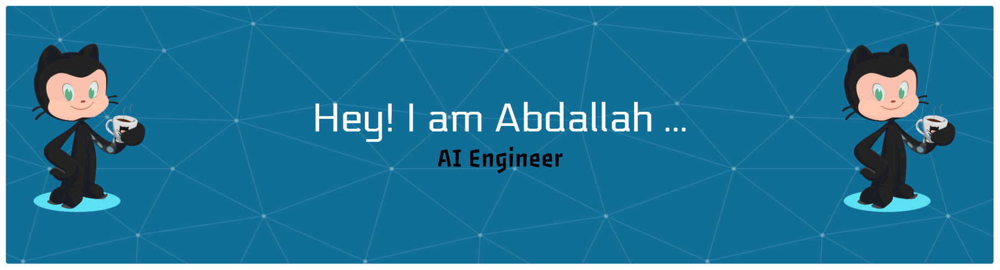

<h1 align="center">Hi 👋, I'm  Abdallah El-Mallah </h1>
<h3 align="center">Artificial Intelligence Student | Agentic AI & LLMs Enthusiast | Head of Dev Essentials @ Microsoft</h3>

  
  
  
  
  

## ✦ About Me

Hi, I'm **Abdullah Al-Mallah**, a **third-year Artificial Intelligence student** passionate about building intelligent systems that create real impact. My main interests lie in **Agentic AI, Large Language Models (LLMs), Deep Learning, AI Agents, and Data Science**.

I’m continuously exploring how AI can go beyond traditional models to become more autonomous, adaptive, and capable of solving complex real-world problems. I enjoy turning ideas into practical solutions and working on projects that combine innovation, intelligence, and scalability.

In addition to my academic journey, I serve as **Head of Dev Essentials at Microsoft**, where I contribute to empowering developers, sharing knowledge, and driving technical growth.

I’m always open to collaboration, learning opportunities, and impactful projects in the world of AI and technology.

**Don’t miss the connection — let’s collaborate to build innovative AI solutions and drive meaningful advancement in technology.**

---

### 🌐 Connect With Me:

  
  

  
  

  

---

### 🛠 Tech Stack & Tools:

  
  

  
  

  
  

  
  

  
  

  
  

  
  

  
  

  
  

  
  

  
  

  
  

  
  

  
  

  
  

  
  

  

---
## 💡 Motto

  <i>"Building intelligent systems today to shape a smarter tomorrow."</i>

